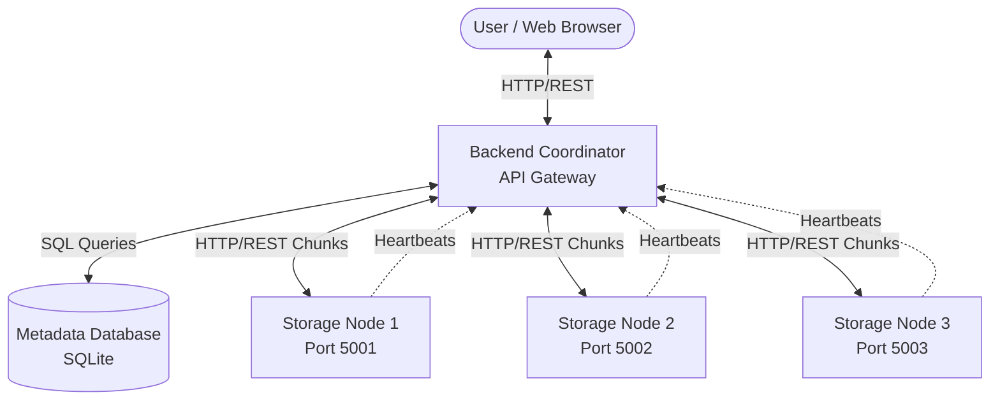
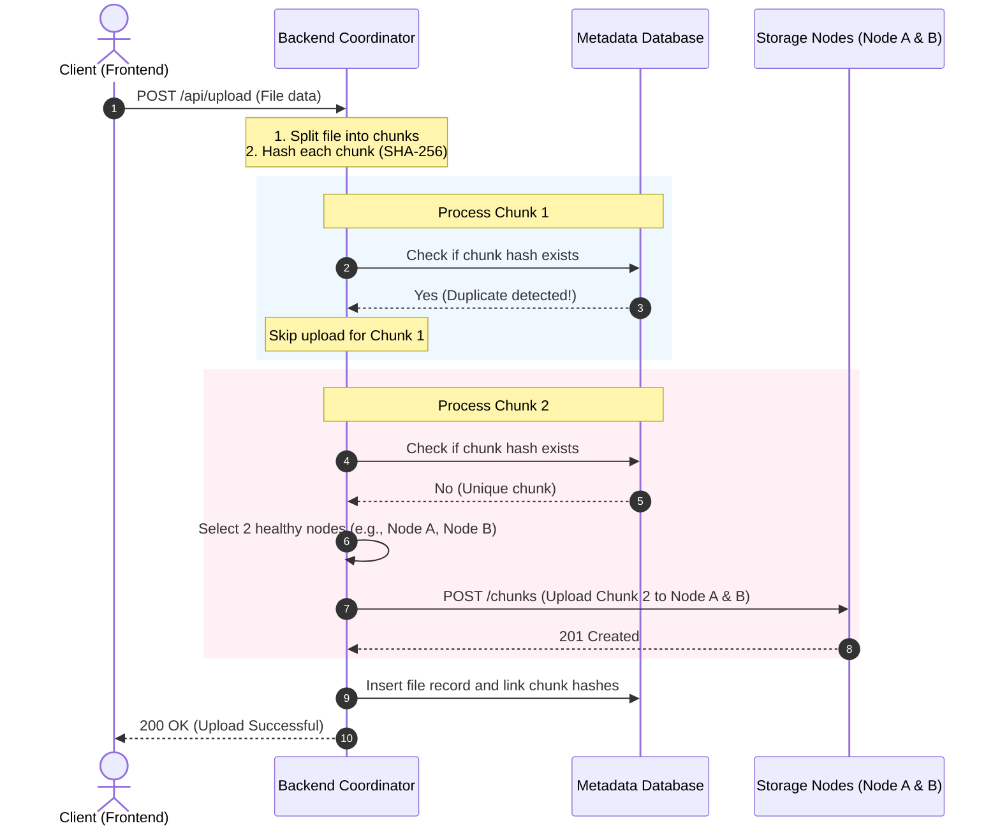
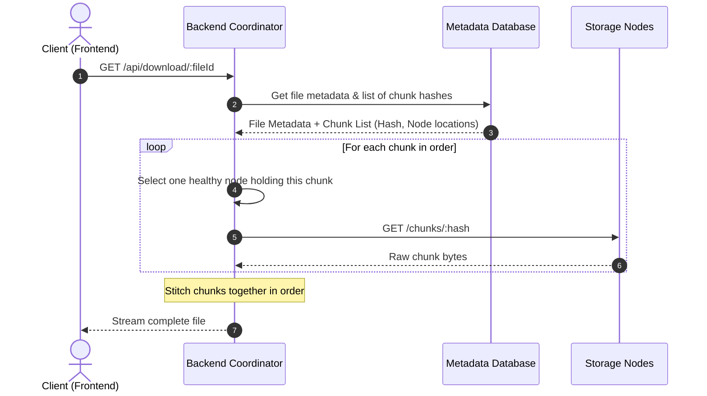
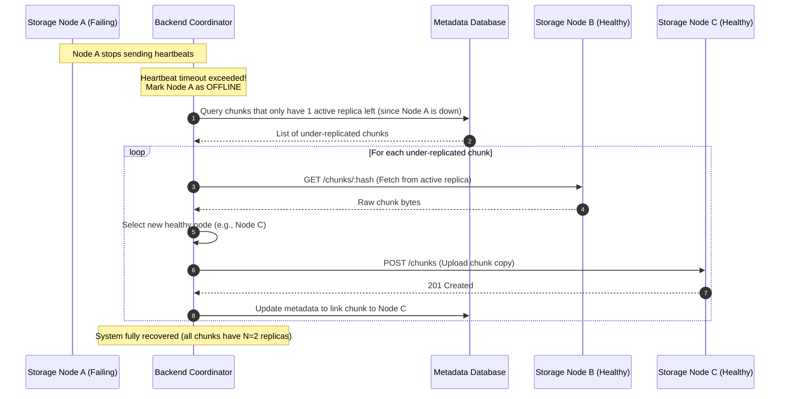

# CloudVault: Distributed Storage System Architecture
## Phase 0: Architectural Design and Core Concepts

Welcome to **CloudVault**! This document outlines the architectural design, core concepts, technology choices, and data flows for CloudVault—a distributed cloud storage system built for learning and demonstration.

---

## 1. Core Concepts (Beginner-Friendly Definitions)

Before diving into how CloudVault works, let's understand the core concepts.

### What Distributed Storage Means
Imagine you have a 1,000-page book. If you keep the whole book in a single drawer and that drawer breaks or catches fire, you lose the entire book. 
**Distributed storage** is like tearing the book into chapters and storing different chapters in different drawers (or desks) across a room. If one drawer breaks, you only lose a piece of the book, not the whole thing—and if you kept copies of those chapters in other drawers, you lose nothing at all! In computer terms, we split files and store them across multiple computers connected over a network instead of a single hard drive.

### What a Storage Node Is
A **Storage Node** is one of those "drawers" in our distributed system. It is a simple computer (or a software program running on a computer) with a hard drive and a network connection. Its sole job is to accept chunks of data, save them to its local disk, and send them back when requested. It does not know what the file is; it only knows how to store and retrieve blocks of bytes.

### What File Chunking Means
**File Chunking** is the process of splitting a large file into smaller, manageable pieces called *chunks* (e.g., 1 MB or 4 MB each) before storing them. If you want to upload a 10 MB video, CloudVault will slice it into five 2 MB chunks. Chunking allows us to:
1. Distribute a single file's parts across different storage nodes so they upload and download in parallel.
2. Store files that are larger than the storage capacity of any single node.
3. Perform **deduplication** at a fine-grained block level.

### What Deduplication Means
**Deduplication** (or "dedup") is the process of identifying duplicate data and storing only one copy of it. 
For example, if 10 students upload the exact same 50 MB textbook PDF, a traditional system stores 500 MB of data. CloudVault uses *Content-Based Deduplication*:
- It calculates a unique cryptographic fingerprint (a hash, like SHA-256) for each chunk.
- If a chunk with the exact same fingerprint already exists in the system, CloudVault does not upload it again. Instead, it updates the database to point the new user's file structure to the existing chunk.
- This saves massive amounts of disk space and network bandwidth!

### What Replication Means
If a storage node crashes or its hard drive fails, any chunks stored exclusively on that node would be lost forever. To prevent this, we use **Replication**.
Replication means storing identical copies of the same chunk on different storage nodes. CloudVault uses a configurable **N-way replication** strategy.
*   **Default Replication Factor (N) = 2**: Every file chunk is stored on **2 different storage nodes**. If Node A dies, the chunk is still safe on Node B.

### What Fault Tolerance Means
**Fault Tolerance** is a system's ability to continue operating properly even when one or more of its components fail (e.g., a storage node loses power or crashes). A fault-tolerant system detects these failures, routes traffic away from the broken node, and automatically initiates recovery to maintain data safety.

---

## 2. System Architecture

CloudVault consists of three main components: the **Frontend UI**, the **Backend Coordinator**, and the **Storage Nodes**.

### Component Details

| Component | Responsibility | State | Technology |
| :--- | :--- | :--- | :--- |
| **Frontend UI** | Provides an interface for users to select files, view upload/download progress, and monitor storage node health. | Stateless | HTML5, Vanilla JavaScript, Tailwind CSS |
| **Backend Coordinator** | The "brain" of the system. Handles client requests, performs file chunking/hashing, queries the database for deduplication, decides which storage nodes store which chunks, and monitors node health. | State coordinator | Node.js, Express |
| **Metadata Database** | Stores structural metadata (files, chunk hashes, mapping of chunks to storage nodes, and storage node health status). | Persistent | SQLite |
| **Storage Nodes** | Simple, independent workers. They store raw binary files (chunks) on their local disks using the chunk's SHA-256 hash as the filename. | Persistent | Node.js, Express |

---

## 3. Communication Protocols

All components communicate using standard **HTTP/REST APIs** returning JSON.

1.  **Client to Coordinator**:
    *   `POST /api/upload`: Uploads a file. The coordinator handles chunking, deduplication checking, replication, and records metadata.
    *   `GET /api/files`: Lists all uploaded files.
    *   `GET /api/download/:fileId`: Downloads a complete reassembled file.
    *   `DELETE /api/files/:fileId`: Deletes a file's references (and deletes orphan chunks).
    *   `GET /api/nodes`: Returns health status of all storage nodes.
2.  **Coordinator to Storage Nodes**:
    *   `POST /chunks`: Uploads a raw chunk payload.
    *   `GET /chunks/:hash`: Downloads a specific chunk payload.
    *   `DELETE /chunks/:hash`: Deletes a chunk from disk.
3.  **Storage Nodes to Coordinator**:
    *   `POST /api/heartbeat`: Sent periodically (e.g., every 5 seconds) by each storage node to the Coordinator to declare it is online. Contains node ID, capacity, and current disk usage.

---

## 4. Operational Workflows

### A. Upload Workflow (With Deduplication & Replication)

When a user uploads a file, the system splits it into chunks and processes them.

**Step-by-Step Upload Flow:**
1.  **File Submission**: The client sends a file to the Backend Coordinator.
2.  **Chunking**: The Coordinator splits the file into fixed-size chunks (e.g., 1 MB).
3.  **Hashing**: The Coordinator calculates the SHA-256 hash of each chunk.
4.  **Deduplication Check**: For each chunk, the Coordinator queries the Metadata DB to see if the hash already exists.
    *   **If it exists**: The system skips uploading it. It only records that the new file uses this chunk.
    *   **If it does not exist**: 
        *   The Coordinator selects $N$ healthy storage nodes (where $N$ is the replication factor, default = 2).
        *   The Coordinator sends the chunk to these nodes concurrently over HTTP.
5.  **Metadata Record**: Once all chunks are processed, the Coordinator writes the file structure (filename, total size, list of chunk hashes in order) to the SQLite DB and returns a success response to the user.

---

### B. Download Workflow

Downloading involves fetching chunks in the correct sequence and stitching them back together.

**Step-by-Step Download Flow:**
1.  **Request**: The client requests a file download by providing the `fileId`.
2.  **Metadata Lookup**: The Coordinator queries the database to get the file name and the list of ordered chunk hashes, along with which nodes currently hold those chunks.
3.  **Chunk Retrieval**: For each chunk hash in the list:
    *   The Coordinator identifies which healthy nodes store that chunk.
    *   It sends an HTTP request to one of those nodes to fetch the raw chunk bytes.
    *   *If the chosen node fails to respond, it transparently falls back to another node hosting the replica.*
4.  **Reassembly & Streaming**: The Coordinator streams the chunks in the exact correct sequence back to the client, merging them on the fly, allowing the client to download the original file.

---

### C. Node Failure & Recovery Workflow

If a storage node crashes, the coordinator detects it and restores the replication factor of affected chunks.

**Step-by-Step Failure Recovery Flow:**
1.  **Missed Heartbeats**: Storage Node A stops sending its periodic health heartbeat (due to network failure, machine crash, or shutdown).
2.  **Timeout Detection**: The Coordinator runs a background worker that checks node status. If a node hasn't sent a heartbeat for more than 15 seconds, the Coordinator marks it as `OFFLINE`.
3.  **Identify Vulnerable Chunks**: The Coordinator queries the database for all chunks mapped to the offline node.
4.  **Replication Count Check**: For each chunk, the Coordinator counts how many *online* nodes still hold it.
    *   If the current online count is less than the replication factor (e.g., only 1 replica remains instead of 2):
        *   The Coordinator downloads the chunk from one of the surviving nodes (e.g., Node B).
        *   It selects a different online, healthy storage node (e.g., Node C).
        *   It uploads the chunk to Node C.
        *   It updates the Metadata DB to show that Node C now also hosts this chunk.
5.  **Restored Safety**: The system has automatically self-healed, bringing the replication factor of all data back to 2, without user intervention.

---

## 5. Technology Choices and Rationale

We selected a simple, robust, and modern technology stack tailored for development speed and educational clarity:

### Node.js & Express (Backend Coordinator & Storage Nodes)
*   **Why**: Node.js uses an event-driven, non-blocking I/O model. This makes it extremely fast and lightweight for streaming file uploads and downloads.
*   **Why Express**: Express is a minimalist web framework for Node.js. It allows us to set up HTTP routes and handle binary request bodies with very little code, keeping the project files highly readable for students.
*   **Unified Language**: Using JavaScript/Node.js on both the coordinator and storage nodes means students only need to know one language to write and understand the entire system.

### SQLite (Metadata Database)
*   **Why**: SQLite is a self-contained, serverless SQL database engine.
*   **Zero Configuration**: There is no database server to install, configure, or run. The entire database is stored in a single local file (e.g., `metadata.db`). This allows the project to run out of the box on any machine.
*   **Migration Path**: It uses standard SQL syntax. If the project is ever scaled up, the code can easily transition to PostgreSQL with minimal changes.

### Vanilla HTML / JavaScript / CSS (Frontend UI)
*   **Why**: Avoids complex JavaScript frameworks (like React, Angular, or Vue) and their heavy build tools (Vite, Webpack, npm scripts).
*   **Instant Running**: A student can double-click `index.html` to run the UI immediately in any browser, making demonstrations seamless and bulletproof.

---

## 6. Environment and Deployment Strategy

### Local Development Environment
To test the distributed nature of the system on a single machine, we run multiple processes locally:
*   **Backend Coordinator**: Runs on `localhost:3000`.
*   **Metadata DB**: A file called `backend/metadata.db`.
*   **Storage Node 1**: Runs on `localhost:5001`. Stores chunks in a folder named `storage-node/data-5001/`.
*   **Storage Node 2**: Runs on `localhost:5002`. Stores chunks in a folder named `storage-node/data-5002/`.
*   **Storage Node 3**: Runs on `localhost:5003`. Stores chunks in a folder named `storage-node/data-5003/`.

By running multiple storage nodes on different ports, we can simulate network latency, shut down individual ports to test node failure, and inspect the different directories to verify replication.

### Future Cloud Deployment Strategy
If CloudVault is scaled and deployed to the cloud, the architecture transitions naturally:
1.  **Frontend**: Hosted on a static web hosting service (like AWS S3 + CloudFront, Vercel, or Netlify) for fast delivery.
2.  **Backend Coordinator**: Run as a containerized microservice (on AWS ECS, Google Cloud Run, or Render) behind an Application Load Balancer.
3.  **Metadata Database**: Migrated to a managed relational database service (like AWS RDS PostgreSQL) to handle concurrent traffic and support database backups.
4.  **Storage Nodes**: Scaled horizontally by running on individual virtual machines (AWS EC2 instances) or container clusters, each utilizing mounted cloud storage volumes (AWS EBS) or cloud object stores (like MinIO) to hold chunk data.
5.  **Private Network**: The Storage Nodes are kept in a private subnet, accessible only to the Coordinator, securing chunk data from direct public access.
