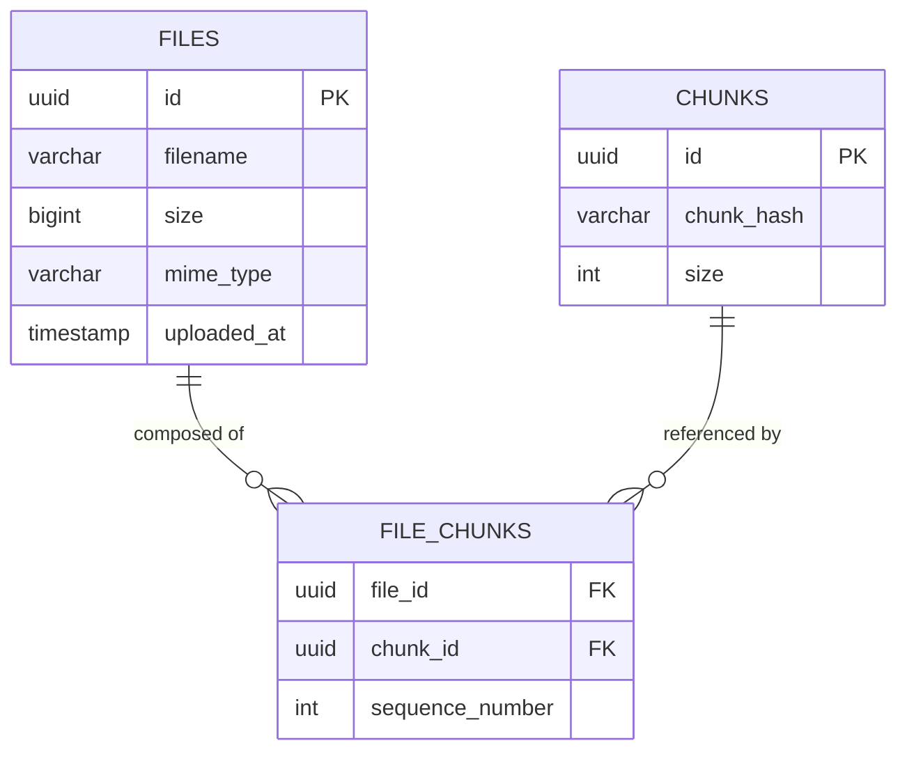

# Phase 3: Relational Metadata Management Documentation
## CloudVault Relational Storage Indexing with PostgreSQL

In Phase 3, we transition metadata management from file-based JSON manifests (`.meta.json`) to a relational SQL database utilizing **PostgreSQL**. The raw file chunks remain stored in the container's isolated local filesystem, while all structural index records are managed in a structured database schema.

---

## 1. Core Architectural Explanations

### What Metadata Means
**Metadata** is "data about data." While the raw bytes of a file represent the actual payload, metadata represents the administrative and structural properties that make that payload useful.
In CloudVault, file metadata includes:
*   **Administrative Metadata**: Original filename, MIME content-type, total file size, and upload timestamp.
*   **Structural Metadata**: Unique file ID, individual chunk IDs, chunk sequence ordering, sizes of individual chunks, and chunk cryptographic SHA-256 hashes.

### Why PostgreSQL Stores Metadata Rather Than File Contents
A common anti-pattern in cloud architecture is storing raw file bytes (binary large objects, or **BLOBs**) directly inside database tables. CloudVault separates these concerns by storing file chunks on the filesystem and indexing pointers inside PostgreSQL:
1.  **Database Performance & Bloat**: Databases load index pages into RAM to perform rapid queries. If large file bytes are stored in table rows, the database memory footprint bloats, leading to slower query times and high RAM usage.
2.  **I/O Bottlenecks**: Relational databases are optimized for handling small, highly structured rows of text and numbers. Filesystems and object stores (like AWS S3) are optimized for streaming continuous, heavy binary data streams.
3.  **Cost and Scale**: Managed databases (like Amazon RDS) are expensive because they require high-performance disks and compute. Filesystem storage (EBS or S3) is cheap. Splitting them keeps operation costs low and database sizes manageable.

### Why PostgreSQL Is Being Introduced
As our distributed system grows, flat JSON files inside a local folder become a significant bottleneck:
*   **Lack of Concurrency**: If multiple uploads happen at the same time, writing or updating flat JSON files is not thread-safe. Multiple processes trying to read/write the same metadata files can corrupt them.
*   **Search Limitations**: Searching for files by upload date, size range, or name requires parsing every single JSON file on disk, which degrades performance as the file count increases.
*   **No Transactional Safety**: If a client uploads 9 out of 10 chunks of a file, and the connection drops, a flat-file system can easily be left in an inconsistent state. PostgreSQL supports **ACID Transactions**, ensuring that metadata is either fully written (all chunks mapped) or completely rolled back if an error occurs.

---

## 2. Database Design & Schema

### Why a Relational Database is Appropriate Here
A relational database is ideal because our data model has a strict structured hierarchy: a file is composed of multiple chunks in a specific ordered sequence. We use primary keys, foreign keys, and relational constraints to enforce data integrity (e.g., ensuring a chunk mapping cannot exist without a valid file entry, and deleting a file cascade-deletes all its sequence mappings).

### Entity Relationship Diagram (ERD)



### Table Definitions

1.  **`files` Table**: Contains administrative records for every uploaded file.
    *   `id`: `UUID` (Primary Key). Generates file tracking ID.
    *   `filename`: `VARCHAR(255)` (Not Null). Original name of the file.
    *   `size`: `BIGINT` (Not Null). Total size of file in bytes.
    *   `mime_type`: `VARCHAR(100)`. Type descriptor (e.g., `image/png`).
    *   `uploaded_at`: `TIMESTAMP WITH TIME ZONE`. Capture upload timestamp.

2.  **`chunks` Table**: Tracks individual chunk blocks written to physical disk.
    *   `id`: `UUID` (Primary Key). References the physical filename `chunk_[id].bin`.
    *   `chunk_hash`: `VARCHAR(64)` (Not Null). The SHA-256 cryptographic hash of the chunk data.
    *   `size`: `INT` (Not Null). Size of this chunk in bytes.

3.  **`file_chunks` Table**: A junction table that maps the Many-to-Many relationship between files and chunks, maintaining chunk order.
    *   `file_id`: `UUID` (Foreign Key -> `files.id`). Cascades on delete.
    *   `chunk_id`: `UUID` (Foreign Key -> `chunks.id`). Cascades on delete.
    *   `sequence_number`: `INT` (Not Null). The index order of the chunk (0, 1, 2...) to ensure correct file reassembly.
    *   *Primary Key*: Composite key `(file_id, sequence_number)`.

---

## 3. Operational Workflows

### What Happens During Upload
1.  **Receive Payload**: The Express server receives the file buffer.
2.  **Generate UUID**: A random UUID is generated to represent the `file_id`.
3.  **Calculate SHA-256 & Slice**: 
    *   The server slices the file into chunks based on `CHUNK_SIZE`.
    *   For each chunk, the server calculates its SHA-256 hash.
    *   It generates a random chunk UUID, saves the chunk bytes to `chunk_[chunkId].bin` on the filesystem, and registers the details in a temporary metadata array.
4.  **Database Transaction**:
    *   The backend initiates a transaction (`BEGIN`).
    *   It inserts the file record into the `files` table.
    *   For each chunk, it inserts its record into the `chunks` table.
    *   It inserts a mapping row into the `file_chunks` table, assigning the correct `sequence_number`.
    *   If all SQL commands succeed, the transaction is finalized (`COMMIT`). If any step fails, changes are rolled back (`ROLLBACK`).

### What Happens During Download
1.  **Request ID**: The client requests `GET /files/:id`.
2.  **Metadata Query**: The Coordinator queries PostgreSQL using a `JOIN` operation:
    ```sql
    SELECT c.id, c.size
    FROM chunks c
    JOIN file_chunks fc ON c.id = fc.chunk_id
    WHERE fc.file_id = $1
    ORDER BY fc.sequence_number ASC;
    ```
3.  **Reconstruction**: The database returns the chunk list sorted by `sequence_number`. The server sequentially reads the chunk files from disk (`chunk_[id].bin`) and streams the combined bytes to the response pipeline.

---

## 4. Communication & Database Access Layer

The database access layer is isolated inside [`storage-node/db.js`](file:///f:/data/Laasya/Antigravity-projects/CloudVault/storage-node/db.js):
*   **Connection Pool**: We use `pg.Pool` to maintain a pool of reusable connections to PostgreSQL, improving response time.
*   **Boot Synchronization Retry**: Containers start asynchronously in Docker Compose. To prevent the node from crashing if PostgreSQL is still booting up, `initializeDatabase()` attempts to connect up to 5 times with a 3-second delay between retries.
*   **Auto Migrations**: On a successful connection, the server runs SQL schemas automatically, building tables if they do not exist.

---

## 5. Architectural Trade-offs

1.  **Disk-to-DB Consistency Trade-off**:
    *   *Approach*: We write chunk files to the local disk *before* committing the metadata transaction to PostgreSQL.
    *   *Trade-off*: If a chunk write fails, the database remains clean. However, if chunk writes succeed but the database connection fails before the `COMMIT`, raw chunk files remain orphaned on disk. We prioritize database integrity (no broken file pointers), but this requires a periodic disk garbage collection script in production.
2.  **Write Amplification during Transaction**:
    *   Uploading a file with 100 chunks requires 102 SQL insertions (1 for the file, 100 for the chunks, 101 for the mapping entries). Grouping these inside a single transaction minimizes the transaction overhead, but it holds locks on database tables for the duration of the write, which can limit write throughput under high concurrency.
3.  **Relational SQL vs. NoSQL Document Stores**:
    *   A document database (like MongoDB) could store files and ordered chunk lists as a single nested document. This avoids joins and simplifies queries. However, relational systems are preferred because they enforce strict schema constraints and support ACID transactions out of the box, ensuring that we never have orphan chunk links or missing sequences.
